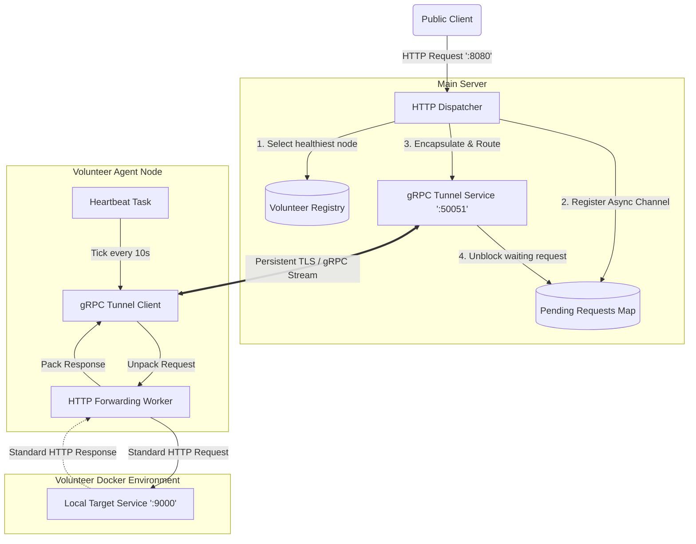

# OpenShard Reverse Tunnel Architecture

The OpenShard reverse tunnel allows a publicly accessible **Main Server** to securely route internet traffic to **Volunteer Agents** that are hidden behind NATs or firewalls, without ever explicitly exposing the volunteers' local networks to the public web.

This works by having the Volunteer strictly initiate an **outbound** persistent gRPC connection to the Main Server. Because the connection is kept alive, the Main Server can then push traffic "down" that existing tunnel at any time.

## 1. System Components Diagram

## 2. Request Lifecycle Sequence

Here is exactly what happens step-by-step from the time the Volunteer boots up, to the time a Client successfully makes a request:

```mermaid
sequenceDiagram
    actor Client
    participant MS as Main Server
    participant VA as Volunteer Agent
    participant Target as Target Service (:9000)

    rect rgb(20, 20, 40)
    note right of MS: Initialization Phase
    VA->>MS: Establish TLS Connection
    VA->>MS: Open Bi-directional gRPC Stream
    VA->>MS: Send { FrameType: REGISTER }
    end

    loop Heartbeat Interval (10s)
        VA->>MS: Send { FrameType: HEARTBEAT, CPU, Mem, Load }
        MS->>MS: Update node health in Registry
    end

    rect rgb(0, 40, 20)
    note right of Client: Dispatch Phase (Client sends request)
    Client->>MS: HTTP GET /index.html (Port 8080)

    MS->>MS: 1. Assign unique Request_ID
    MS->>MS: 2. Create pending channel & Wait

    MS->>VA: Send { FrameType: REQUEST, Payload: HttpRequest }
    VA->>Target: Forward HTTP GET /index.html (Port 9000)
    Target-->>VA: HTTP 200 OK (body: index.html)

    VA->>MS: Send { FrameType: RESPONSE, Payload: HttpResponse }

    MS->>MS: 3. Match Request_ID in PendingMap
    MS->>MS: 4. Pass response body to waiting channel
    MS-->>Client: HTTP 200 OK (body: index.html)
    end
```

## How the pieces fit together:

1. **`dashmap` and `oneshot` (The Wait Mechanism):**
   When the `Main Server` receives an HTTP request via Axum, it generates a `Uuid` (request ID) and forms a `tokio::sync::oneshot` channel. It drops the "Receiver" end of the channel into the `Pending Requests Map` and then forces the Axum HTTP handler to `.await` (wait) until a response comes back.
2. **Protocol Buffers (`tunnel-proto`):**
   HTTP requests are complex (they have methods, headers, URIs, and byte bodies). Before sending the request down the gRPC stream, the Main Server serializes all of these parts into a `TunnelFrame` using `prost` (Protobuf). The Volunteer Agent unpacks this binary blob back into a usable HTTP request.

3. **Routing without IPs:**
   Because all Volunteers share the same connection methodology, the Main Server never cares about a Volunteer's IP address. It only cares about their `volunteer_id` and the metrics they send via their heartbeats. When a request comes in, the server blindly grabs the healthiest `volunteer_id` and sends the frame down that specific stream socket.
